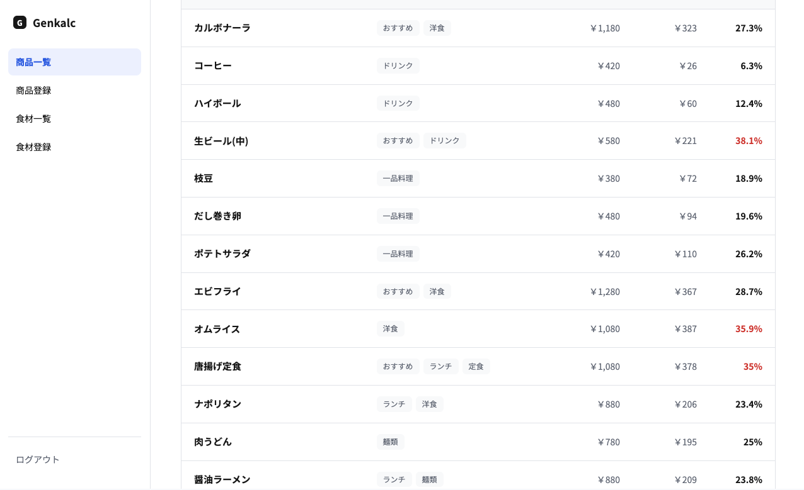
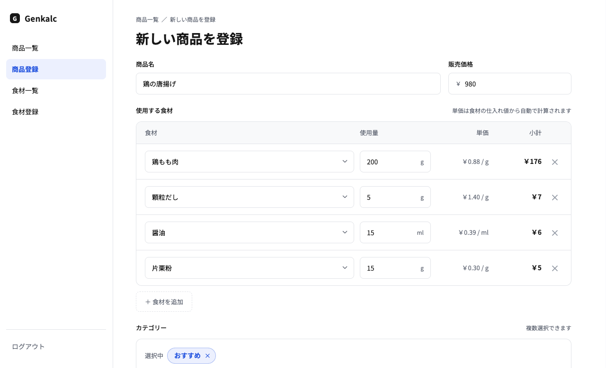
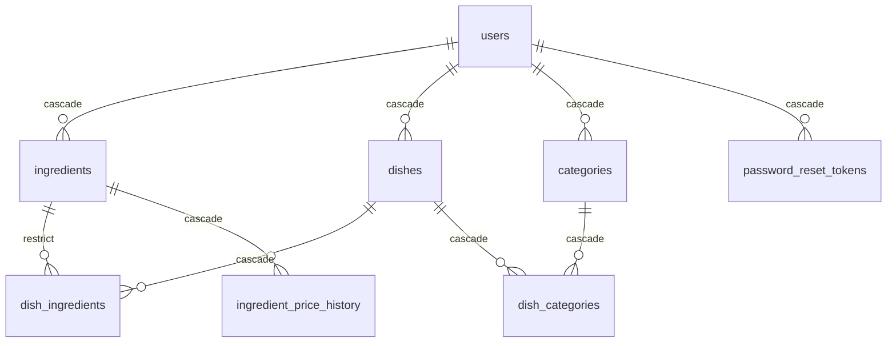

# Genkalc（ゲンカルク） - 原価 × calculate -

[](https://github.com/tomtaylor24/food-cost-calc/actions/workflows/ci.yml)

飲食店向けの原価計算ツールです。

食材を登録し、その食材を基に商品を作成することで原価の計算が簡単に行なえます。

また、食材の仕入れ値に変動があった場合、食材を編集することでその食材が使われている商品すべての原価が自動で変更されます。

- **デモ（登録不要）**: https://ik1-331-25649.vs.sakura.ne.jp




## 2. なぜ作ったのか

今まで居酒屋、イタリアン、ファストフード店などジャンルを問わず様々な飲食店で勤務してきました。その中で、原価の管理はノートにまとめたり、エクセルで管理したり、はたまた計算せず雰囲気でやっていたり、様々な種類がありました。

**一生懸命な働きがきちんと報われてほしい**

飲食店はただでさえ長時間労働なので、料理外にかかる時間を減らしてほしいと思いました。

また、デジタルに苦手な人が多いので、このツール一つで頭を使わず計算できるようになります。

さらに、相次ぐ値上げの影響で店舗での原価管理・売価設定が追いつかず、一生懸命な働きが報われているのだろうかと感じ、そこを解消できるツールになればと思い作成しました。

私が感じた問題点は3点ありました。

**1. 昨今の物価高騰の影響で、売価の見直しが頻繁に必要になる**

ノートだと食材の仕入れ値が変わっても原価は変わりません。また、エクセルの場合はマクロを組んでいるところもありましたが、パソコンを開いて「さあ値段を打ち込むぞ」という感じで気軽にできる内容ではありませんでした。それが今ではWebアプリなので、仕入先から価格改定のお知らせが届いた瞬間にスマホでサイトを開き、食材の仕入れ値を変更することで自動で原価率も計算されるのが便利な点です。

**2. 共有が簡単**

エクセルだと画面のスクショやファイルを渡すことでしか内容が共有できませんでしたが、Webアプリになったことで、同じアカウントでログインすればURLからみんなが同じ情報を共有できます。

**3. カテゴリー毎の原価率やソート機能など、複雑な機能が使える**

ノートで管理しているところではこれがまずできません。エクセルですでに作っている飲食店は使えますが、みんながみんなエクセルのマクロを使いこなせるわけではありません。また、エクセルだと罫線が並んで見にくいですが、Webアプリになったことでデザインの融通が利き、見やすくなりました。

## 3. 作り方とAIの使い方

まず、アプリとして最低限動くもの（会員登録とログイン、食材と商品の登録・編集・削除、商品と食材の紐づけと原価計算、TypeScriptへの移行）を、本やハンズオン形式の教材と併走しながら自分で書きました。

その後、現場のフィードバックを取り入れた機能追加や、SupabaseからMySQLへの移行、サーバーの構築は、AIと一緒に進めました。

途中、やりたい内容がどんどんできるのが楽しくて、理解そっちのけで進めてしまったのが反省点です。小さな単位で作り、AIの解説で理解してから次へ進む流れにしたほうが良かったと感じています。そのため一通り機能が出来上がったあとに全ファイルを読み直し、ファイルごとに役割と処理の流れを記録しました。ただ、SQLの細かい部分とサーバー構築は、まだ読んで理解した段階です。

## 4. 現場の声で改善したこと

今働いている居酒屋の店長に見せました。見せた時点でできていたのは、カテゴリー分け、カテゴリーごとの原価率、商品の一覧、並び替え、食材の検索、スマホ対応です。

見せたあとに、次のものを追加しました。

- **仕入れ値の変更履歴**：仕入れ値は目まぐるしく変わるので、その履歴を追いたいとのことでした。あまりにも高くなった場合に、他の仕入先を探す判断にも使えます。
- **ひらがなでの検索**：エクセルでは、食材から商品を作るときに、食材に登録した名前と一字一句同じでないと計算できませんでした。「鶏もも肉」「鳥肉」「とりもも」のどれで登録したかまでは覚えていないので、それを解消するためです。
- **仕入先と備考欄**：どちらもメモとして残しておきたいとのことでした。
- **税抜きでの入力**：納品書は基本的に税込みで来ますが、仕入先によっては税抜きで届きます。その場合、アプリに打ち込む前に電卓で税込みに直した値を打つ必要がありました。
- **歩留まり**（仕入れた量のうち実際に使える割合）：魚は1匹で仕入れますが、使えるのは50%程度です。そのぶん原価が上がるので、計算に入れられるようにしました。

税抜きや歩留まりは一部の仕入先・食材にしか当てはまらないので、デフォルトではオフにして、必要な場合だけチェックボックスでオンにする形にしました。

## 5. できること

**アカウント**

- 会員登録
- ログイン
- パスワードの再設定（登録したメールアドレスにリンクが届きます）

**食材の登録・編集**

- 単価：仕入れ値と仕入れ量から、単位あたりの単価が表示されます（￥0.88 / gなど）
- 歩留まり：歩留まりを含んだ原価を出せます
- 仕入れ値の推移：仕入れ値に変更があった場合、過去の履歴も表示されます

**商品の登録**

- 自動原価表示：食材と使用量を決めることで、登録前に原価が自動で計算されます
- 食材の検索：食材の名前やよみがなで、追加する食材を検索できます
- カテゴリー：カテゴリーを複数つけることができます

**商品の一覧**

- 原価率表示：すべての商品の平均原価率が表示できます
- カテゴリー別表示：ランチ、ディナーといったカテゴリーに絞ったうえで、その分類の平均原価率を確認できます
- ソート機能：原価率、原価、販売価格の昇順・降順で並び替えができ、どの商品の原価が高くなっているのかなどを確認できます

## 6. 設計で考えたこと

**原価はデータベースに保存せず、表示するたびに計算する**

商品の原価は、食材の仕入れ値・仕入れ量・使用量から計算できる値なので、商品のテーブルに原価のカラムを持たせていません。原価を保存してしまうと、食材の仕入れ値を変えたときに、その食材を使っている商品を全部探して更新する必要が出てきます。1つでも漏れると、古い原価のまま原価率が表示されます。保存せずに毎回計算すれば、仕入れ値を1か所変えるだけで全商品に反映されます。

計算は1つの関数にまとめていて、商品登録画面のプレビューも商品一覧も同じ関数を通しています。そのため、登録前に見た原価と登録後の原価がずれません。

代わりに、商品一覧を開くたびに全商品ぶんの計算が走ります。商品が数千件になったら見直しが必要になります。

**使われている食材は削除できないようにする**

食材と商品は中間テーブルで結んでいて、食材を消すときの挙動だけ`ON DELETE RESTRICT`にしています。商品で使われている食材を消すと、その商品の原価が計算できなくなるからです。商品やカテゴリーを消したときは、中間テーブルの行が`CASCADE`で道連れに消えるだけで、原価には影響しません。

画面では、使われている食材の削除ボタンを押せなくして、どの商品で使われているかを一覧で出しています。APIは事前に数えず、DBが拒否したエラーをメッセージに変えて返しています。最後に止めているのはデータベースの制約で、画面の制御は親切のためのものです。

## 7. データベース



定義は[`db/schema.sql`](db/schema.sql)にあります。

## 8. 技術構成

Next.js（App Router）/ React / TypeScript / MySQL（mysql2）/ Zod / react-hook-form / Sass / jose（JWT）/ bcryptjs

## 9. 動かし方と公開先

MySQLはDockerで起動します。

```bash
git clone https://github.com/tomtaylor24/food-cost-calc.git
cd food-cost-calc
npm install

docker compose up -d
docker compose exec -T db mysql -u genkalc -pgenkalcpass genkalc < db/schema.sql

cp .env.example .env.local
npm run dev
```

必須の環境変数は`DATABASE_URL`と`JWT_SECRET`の2つです。

**ポートフォリオ用（さくらのVPS）**

- アプリとMySQLは同じサーバーで動いています
- `main`にpushするとGitHub Actionsが動いて、自動で反映されます

**店舗用（Netlify + Aiven）**

- 今働いている店舗で実際に使ってもらう環境です。URLは公開していません
- 今後も無料で使い続けるために、Netlify（アプリ）とAiven（MySQLの無料枠）の構成を選びました
- Aivenの無料枠は約5時間アクセスがないと止まってしまうので、Netlifyのスケジュール関数で1時間ごとにアクセスして起こしています

## 10. 今後の課題

- **仕込み品を商品の材料にできない**：例えば自家製ダレを商品として登録しても、それを他の商品の材料として使い回すことはできません。
- **単位の換算ができない**：例えば1kgで仕入れた鶏もも肉を商品で使うとき、0.2kgのように登録時と同じ単位でしか入力できず、200gとは入力できません。
- **スタッフごとのアカウントや権限がない**：店で1つのアカウントを共有する前提なので、誰が登録・編集したかまでは追えません。

